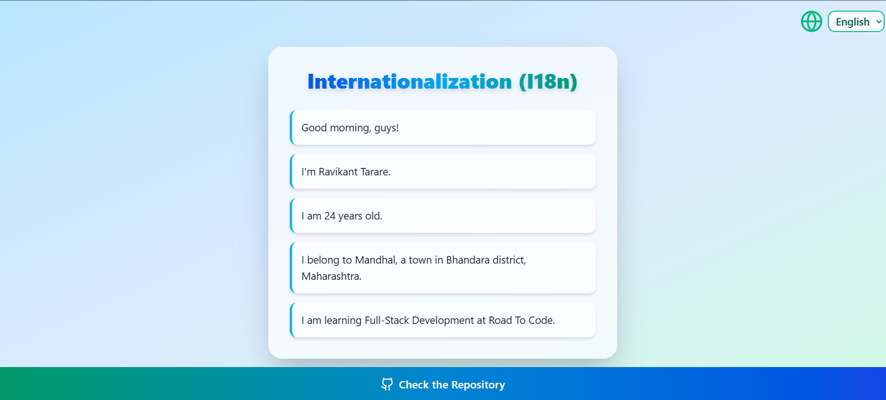

# Internationalization (I18n)

A beautiful, responsive React app demonstrating internationalization (i18n) with language switching and dynamic message rendering using Tailwind CSS.

## ✨ Features

- Switch between English, Marathi, and Hindi
- Language preference saved in localStorage
- Dynamic message interpolation (e.g., age)
- Stunning, responsive UI with Tailwind CSS and glassmorphism
- Fast development with Vite
- Modern React (v19) and functional components

## 🛠️ Tech Stack

- [React](https://react.dev/)
- [Vite](https://vitejs.dev/)
- [Tailwind CSS](https://tailwindcss.com/)
- [lucide-react](https://lucide.dev/icons/)

## 🌐 Usage

- Select your preferred language from the dropdown.
- The app will remember your choice and display all messages in that language.
- Dynamic values (like age) are automatically interpolated.
